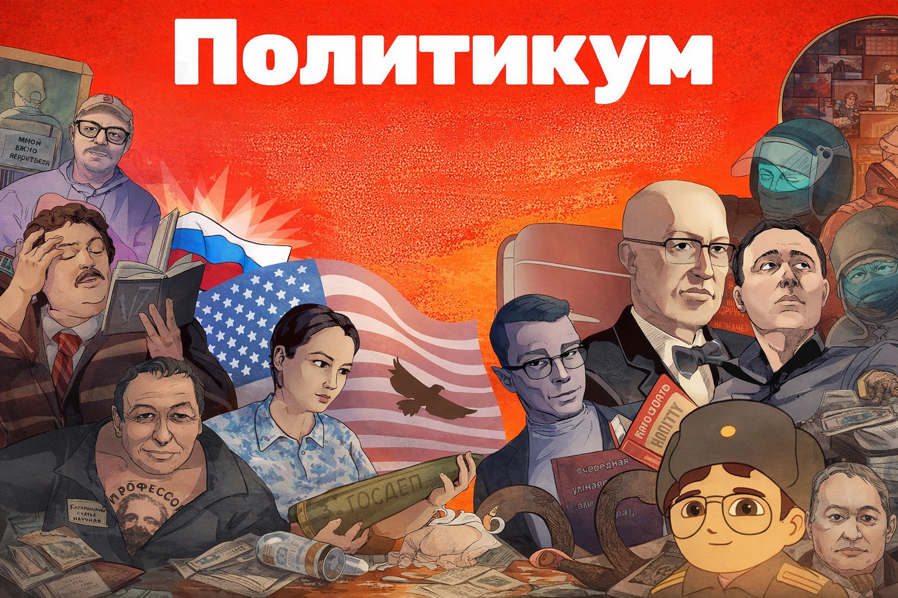
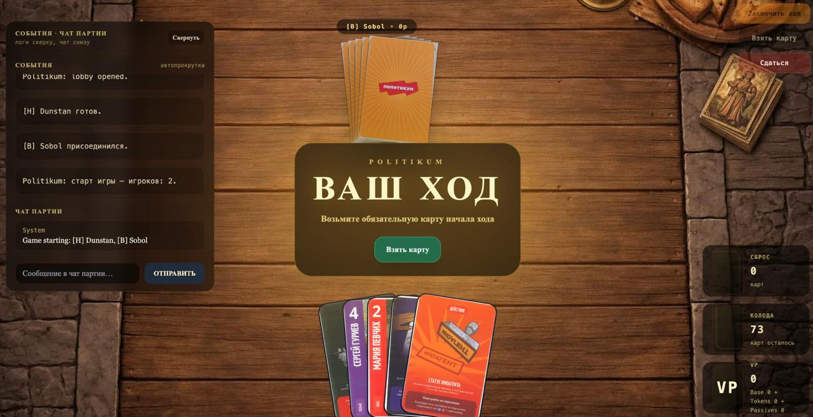
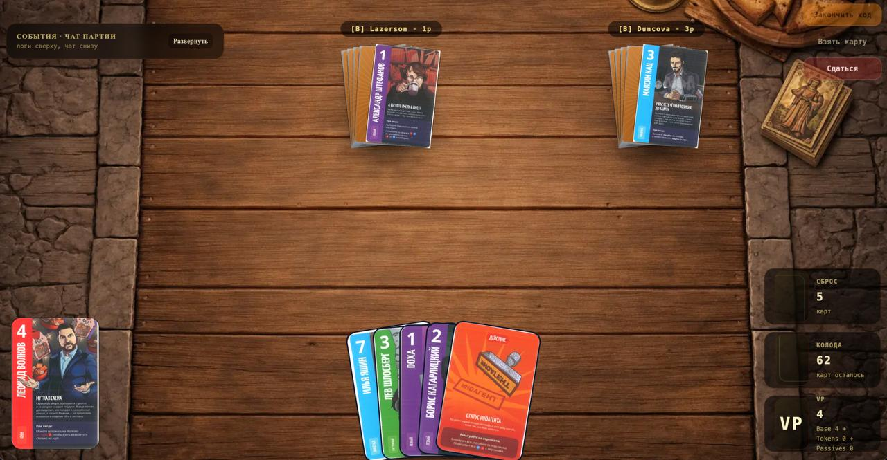
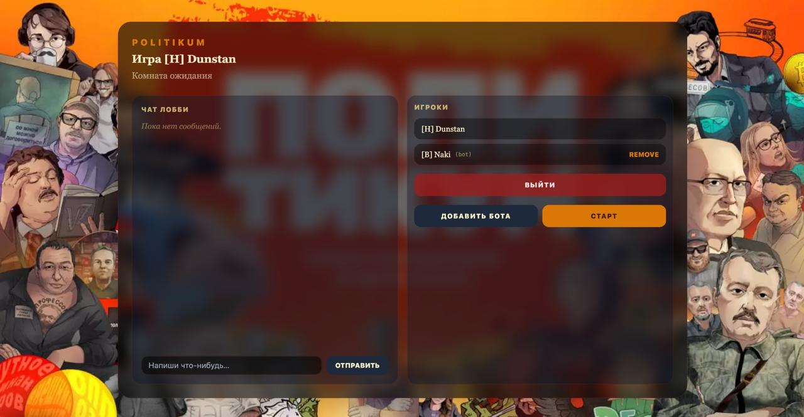

<p align="center">
  
</p>

<p align="center">
  <a href="http://109.107.167.179/">
    
  </a>
</p>

<h2 align="center">
  <a href="http://109.107.167.179/">🔥 ОТКРЫТЬ ИГРУ ПРЯМО СЕЙЧАС 🔥</a>
</h2>

<p align="center">
  <a href="https://github.com/ENoti/politikum/issues">
    
  </a>
</p>

<h1 align="center">🎭 Politikum</h1>

<p align="center">
  <b>Онлайн-карточная политическая игра</b><br/>
  Персонажи • События • Действия • Коалиции • Боты • Логи • Чат • CI/CD
</p>

<p align="center">
  
  
  
  
  
  
</p>

---

## ✨ Что такое Politikum

**Politikum** — это многопользовательская карточная игра, где игроки строят коалиции, разыгрывают персонажей, используют действия, проживают случайные события и борются за максимальное количество **VP**.

Каждая партия — это смесь:
- интриг,
- тактики,
- контроля стола,
- неожиданных событий,
- и красивого визуального UX.

---

## 🖼️ Визуальный стиль игры

<p align="center">
  
</p>

<p align="center">
  
  
</p>

---

## 🎮 Игровой процесс

### Каждый ход игрок:
1. получает начало хода
2. берет карту
3. разыгрывает персонажа или действие
4. разрешает эффекты и события
5. завершает ход

### В игре есть:
- **персонажи** с уникальными способностями
- **карты действий** для контроля, отмены и атаки
- **события**, влияющие на одного игрока или на всех
- **боты**
- **чат партии**
- **подсвеченные логи**
- **динамические пуши и уведомления**

---

## 🃏 Основные механики

<table>
  <tr>
    <td>👤 <b>Персонажи</b></td>
    <td>Уникальные карты с on-enter, passive и targeted способностями</td>
  </tr>
  <tr>
    <td>⚡ <b>Действия</b></td>
    <td>Отмена, защита, блокировка, дебаффы, возврат карт</td>
  </tr>
  <tr>
    <td>🎲 <b>События</b></td>
    <td>Случайные эффекты из отдельной колоды</td>
  </tr>
  <tr>
    <td>🎯 <b>Таргетинг</b></td>
    <td>Выбор целей прямо на столе</td>
  </tr>
  <tr>
    <td>🧠 <b>Боты</b></td>
    <td>Автоматические решения и игра против человека</td>
  </tr>
  <tr>
    <td>💬 <b>Логи + чат</b></td>
    <td>Живой журнал партии и сообщения игроков</td>
  </tr>
  <tr>
    <td>🏆 <b>VP</b></td>
    <td>Очки влияния, жетоны, усиления и штрафы</td>
  </tr>
</table>

---

## 🌟 Особенности проекта

### UI / UX
- красивый стол и игровые панели
- отдельная рука игрока
- отдельная коалиция на столе
- динамический пуш **«ВАШ ХОД»**
- всплывающие уведомления об атаках и событиях
- объединённая панель **логов и чата**
- hover / zoom карт
- декоративный визуал колоды, сброса и VP

### Игровая логика
- response windows
- pending state machine
- последовательное разрешение эффектов
- взаимодействие между персонажами, действиями и событиями
- исключения и специальные правила отдельных карт

### Техническая часть
- backend на Spring Boot
- frontend на React + Vite
- кастомный JS bridge для игрового движка
- GitHub Actions CI/CD
- self-hosted runner
- deploy на Linux VPS через systemd + nginx

---

## 🏗️ Архитектура

```text
politikum/
├── politikum-main-backend/
│   ├── src/main/java/
│   ├── src/main/resources/
│   │   ├── engine/
│   │   ├── application.yml
│   │   └── sql/
│   └── target/
│
├── politikum-main-frontend/
│   ├── src/
│   ├── public/
│   └── dist/
│
└── .github/
    └── workflows/
        ├── ci.yml
        └── deploy.yml
