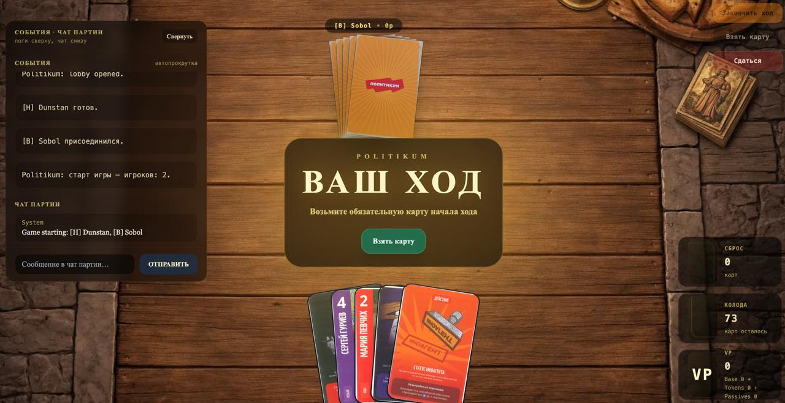
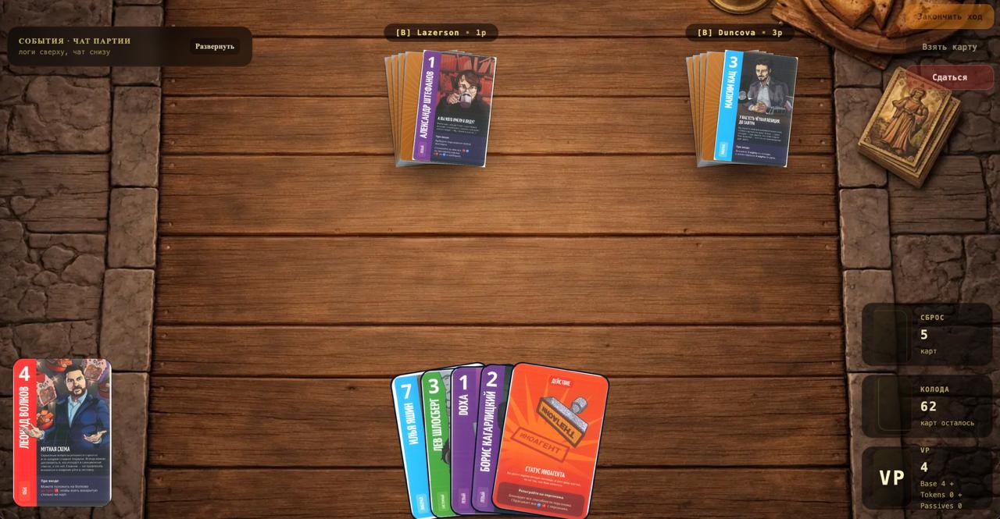
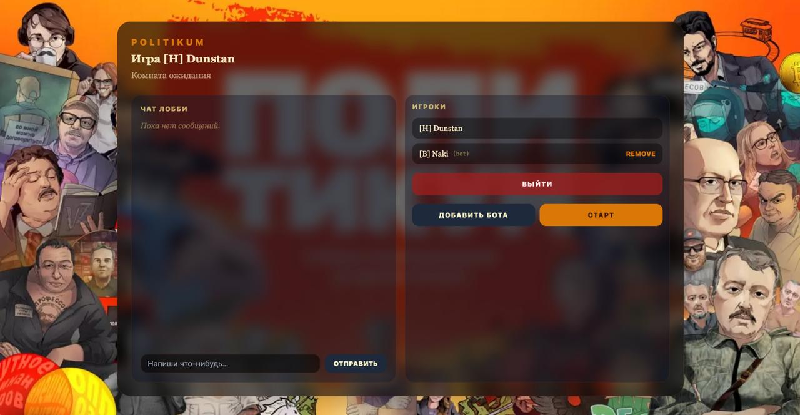

<p align="center">
  
</p>

<p align="center">
  <a href="http://109.107.167.179/">
    
  </a>
  <a href="https://github.com/ENoti/politikum/issues">
    
  </a>
</p>

<h1 align="center">🎭 Politikum</h1>

<p align="center">
  <b>Многопользовательская карточная политическая игра</b><br />
  Персонажи • События • Действия • Коалиции • Боты • Чат • Турниры
</p>

<p align="center">
  
  
  
  
  
  
</p>

---

## ✨ О проекте

**Politikum** — онлайн-карточная игра для 2–5 игроков. Игроки собирают коалиции, разыгрывают персонажей и действия, реагируют на ходы соперников и получают очки влияния за состав своей коалиции.

Партия сочетает тактику, политические интриги, контроль стола, случайные события и взаимодействие между игроками. Можно играть против людей или ботов, общаться в лобби и партии, а также участвовать в турнирах.

Игровые правила полностью выполняются на Java. JavaScript используется только на клиентской стороне для интерфейса.

## 🖼️ Визуальный стиль

<p align="center">
  
</p>

<p align="center">
  
  
</p>

## 🎮 Игровой процесс

В начале хода игрок получает карты и выбирает действие. Он может разыграть персонажа, использовать карту действия, активировать способность или завершить ход. Эффекты разрешаются последовательно, а для сложных действий создаются окна выбора и реакции.

В игре есть:

- персонажи с уникальными способностями;
- карты действий для атаки, защиты, отмены и контроля;
- события, влияющие на одного игрока или всю партию;
- боты с тем же игровым движком, что и люди;
- состояния выбора и окна реакций;
- журнал партии, чат и уведомления;
- турниры, профили, статистика и администрирование.

## 🃏 Основные механики

| Механика | Описание |
| --- | --- |
| 👤 Персонажи | Карты с постоянными, входными и целевыми способностями |
| ⚡ Действия | Атаки, защита, отмена, блокировки, дебаффы и возврат карт |
| 🎲 События | Случайные эффекты из отдельной колоды |
| 🎯 Таргетинг | Выбор игрока, карты или другого объекта прямо на столе |
| 🧠 Боты | Автоматические решения через общий Java-движок |
| 💬 Логи и чат | Журнал партии и сообщения игроков |
| 🏆 Очки влияния | Начисления, бонусы, штрафы и специальные условия победы |

## 🏗️ Архитектура

```text
politikum/
├── politikum-main-backend/
│   ├── src/main/java/com/politikum/
│   │   ├── controller/       # REST API
│   │   ├── service/          # матчи, профили, новости и турниры
│   │   ├── game/             # доменная модель и правила игры
│   │   ├── repository/       # работа с данными
│   │   └── config/           # Spring и база данных
│   ├── src/main/resources/
│   │   ├── application.properties
│   │   └── db/migration/     # миграции схемы
│   └── pom.xml
│
├── politikum-main-frontend/
│   ├── src/                  # React-приложение
│   ├── public/               # карты, изображения и звуки
│   └── package.json
│
├── docs/                     # изображения и документация
└── .github/workflows/        # CI/CD
```

### Backend

Backend построен на Spring Boot и Java 21. Он отвечает за REST API, авторизацию, матчи, турниры, профили, чат, статистику и сохранение состояния.

Игровой движок разделён на типизированные компоненты:

- `GameState` — состояние партии;
- `GameEngine` — применение ходов и переходы состояния;
- `TurnManager` — порядок ходов и фазы;
- `CardEffect` — эффекты карт;
- `BotStrategy` — решения ботов;
- `ScoreCalculator` — очки и условия победы;
- `GameStateMapper` — безопасное представление состояния для клиента.

Каждый ход проходит валидацию и либо атомарно изменяет состояние, либо полностью откатывается. Параллельные запросы к одному матчу защищены версией состояния.

### Frontend

Frontend построен на React и Vite. Клиент отображает игровое поле, руку игрока, коалиции, цели, окна реакций, уведомления, журнал и чат. Сетевое взаимодействие выполняется через REST API.

### Данные

По умолчанию используется SQLite. Схема базы изменяется управляемыми миграциями. Игровые состояния, пользователи, сессии, матчи, статистика и турниры хранятся отдельно на уровне доменных таблиц.

## 🧪 Тестирование

Backend покрывается несколькими уровнями тестов:

- unit-тесты доменной модели и игровых правил;
- сценарные тесты карт, способностей, реакций и условий победы;
- property-based тесты игровых инвариантов;
- repository-тесты на временной SQLite-базе;
- интеграционные тесты Spring Boot;
- `MockMvc`-тесты REST API;
- контрактные тесты JSON-ответов для frontend;
- конкурентные и нагрузочные тесты матчей;
- smoke-тесты после деплоя.

Ключевые инварианты:

- карта не может одновременно находиться в руке и сбросе;
- завершённая партия не принимает новые ходы;
- активный игрок и текущая фаза всегда валидны;
- недействительный ход не изменяет состояние;
- клиент не получает credentials, чужие руки и серверные секреты.

Запуск тестов:

```bash
cd politikum-main-backend
mvn test
mvn verify
```

Проверка frontend:

```bash
cd politikum-main-frontend
npm ci
npm run lint
npm run build
```

## 🚀 Локальный запуск

Требования:

- Java 21;
- Maven 3.9+;
- Node.js 20+;
- npm 10+.

Запуск backend:

```bash
cd politikum-main-backend
mvn spring-boot:run
```

По умолчанию API доступен на `http://localhost:8080`.

Запуск frontend в отдельном терминале:

```bash
cd politikum-main-frontend
npm ci
npm run dev
```

Перед запуском production необходимо задать конфигурацию через переменные окружения или внешний configuration file. Секреты не хранятся в репозитории.

Основные параметры:

| Параметр | Назначение |
| --- | --- |
| `SERVER_PORT` | Порт Spring Boot |
| `POLITIKUM_DB_PATH` | Путь к SQLite-базе |
| `POLITIKUM_ADMIN_TOKEN` | Токен административного API |
| `POLITIKUM_PROFILE_IMG_DIR` | Каталог изображений профилей |
| `POLITIKUM_NEWS_PATH` | Путь к файлу новостей |

## 🔌 Основные API

| Группа | Назначение |
| --- | --- |
| `/auth/**` | Регистрация, вход, сессии и профиль |
| `/games/politikum/**` | Создание матчей, состояние и ходы |
| `/public/**` | Новости, лобби, профили и турниры |
| `/admin/**` | Администрирование, матчи, багрепорты и турниры |

Состояние матча возвращается в безопасном представлении, зависящем от игрока. Сервер является источником истины для правил, ресурсов, целей и результата партии.

## 🔄 CI/CD

Каждый pull request проходит последовательность:

```text
compile
→ unit tests
→ integration tests
→ static analysis
→ frontend lint/build
→ contract tests
→ package
```

Деплой в production выполняется только после успешного CI. На staging дополнительно запускаются smoke-тесты API и базовый сценарий партии. Production разворачивается на Linux VPS через systemd и nginx.

## 🔐 Безопасность

- секреты передаются через окружение и не коммитятся;
- пароли и пользовательские токены хранятся только в хешированном виде;
- credentials матчей не выдаются другим игрокам;
- игровые состояния фильтруются перед отправкой клиенту;
- административные endpoints требуют отдельной авторизации;
- операции изменения состояния выполняются атомарно;
- зависимости и секреты проверяются в CI.

## 📄 Лицензия и обратная связь

Для сообщения об ошибке используйте [GitHub Issues](https://github.com/ENoti/politikum/issues). В описании желательно указать версию приложения, сценарий воспроизведения и идентификатор матча, если он доступен.
